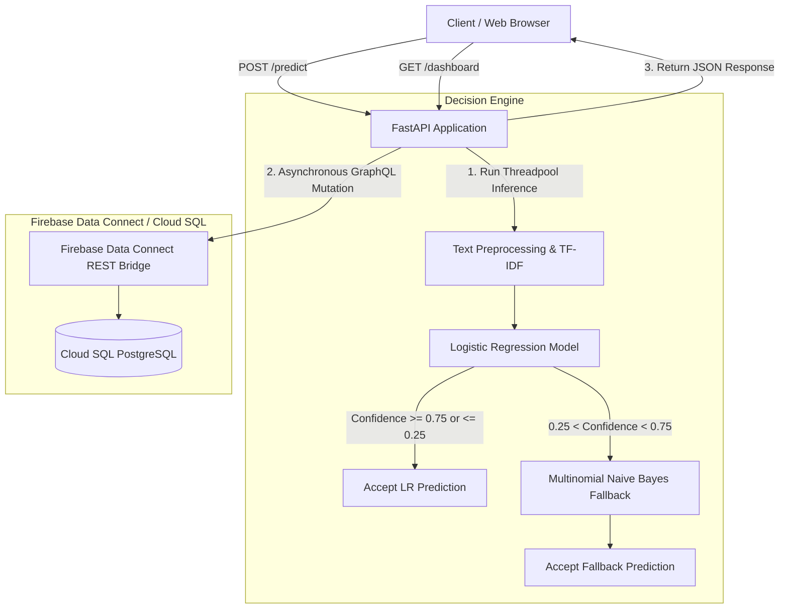

# Tweet Disaster Prediction

A production-grade machine learning service and REST API that classifies social media text to identify disaster-related events using a confidence-aware model ensemble.


## Overview

Social media platforms contain large volumes of disaster-related vocabulary that is frequently used in hyperbolic or metaphorical contexts (for example, "this exam is a disaster" or "the new track is fire"). Traditional single-model classifiers often produce false alarms on metaphorical text or fail to quantify prediction uncertainty, leading to unreliability in critical monitoring contexts.

The **Tweet Disaster Prediction Service** solves this issue by deploying a confidence-aware decision pipeline. The system combines a primary Logistic Regression model for initial probability estimation with a conservative Multinomial Naive Bayes fallback model when predictions fall into an uncertain probability band. Every request and model decision is persisted to a PostgreSQL database via Firebase Data Connect GraphQL service and rendered live on an embedded web monitoring dashboard.

This project is designed for software engineers, ML developers, and technical reviewers seeking a persistence-backed, production-oriented classification pipeline with strict validation and observable confidence metrics.

## Key Features

- **Confidence-Aware Ensemble Routing**: Evaluates prediction probability using a primary Logistic Regression model; routes uncertain samples (confidence between `0.25` and `0.75`) to a conservative Naive Bayes fallback model.
- **REST API Backend**: High-performance FastAPI application exposing endpoints for real-time inference, service health checks, and aggregated historical data.
- **Persistent Data Storage**: Asynchronous integration with Firebase Data Connect (Cloud SQL PostgreSQL) storing all incoming tweet requests and predicted classification events.
- **Real-Time Monitoring Dashboard**: Server-rendered HTML/CSS/JS dashboard displaying total request volume, disaster detection rates, average confidence scores, model source distributions, and recent predictions feed.
- **Input Validation & Preprocessing**: Pydantic schema validation coupled with automated text cleaning (URL removal, mention stripping, hashtag symbol removal, character normalization, and white-space collapsing).
- **Non-Blocking Inference Architecture**: Offloads CPU-bound machine learning predictions to dedicated threadpools (`run_in_threadpool`) to preserve the FastAPI async event loop responsiveness.
- **Automated Testing Suite**: Comprehensive unit and integration test suite using `pytest` with mocked database interactions, alongside an asynchronous HTTP load testing script.

## Architecture

The system consists of five primary layers: the HTTP API layer, input validation and preprocessing, the dual-model decision engine, the database persistence bridge, and the web analytics frontend.



### Component Responsibilities

- **`api/main.py` & `api/routes.py`**: Initializes the FastAPI application, manages lifespan database connections, routes HTTP requests, and serves the dashboard.
- **`src/models/decision_engine.py`**: Loads serialized scikit-learn artifacts (`.pkl`), transforms input text using TF-IDF, evaluates prediction confidence against thresholds, and executes fallback routing logic.
- **`api/database.py` & `api/crud.py`**: Provides an asynchronous HTTP client (`FirebaseDataConnectClient`) using `httpx` with connection pooling to interact with Firebase Data Connect REST APIs for GraphQL queries and mutations.
- **`api/templates/dashboard.html`**: Embedded monitoring user interface visualizing system analytics, time-series distributions, and live tweet events.

## Project Structure

```text
Tweet_disaster_prediction/
├── api/
│   ├── main.py              # FastAPI application setup and lifespan initialization
│   ├── routes.py            # API endpoint definitions and dashboard page rendering
│   ├── database.py          # Asynchronous HTTP client for Firebase Data Connect
│   ├── crud.py              # Database mutation and query helper functions
│   ├── schemas.py           # Pydantic data schemas for requests and responses
│   ├── static/              # Dashboard CSS stylesheet and JS logic
│   └── templates/           # Server-rendered dashboard HTML template
├── src/
│   ├── config.py            # Central environment and threshold configuration
│   ├── data_work/
│   │   ├── load_data.py     # CSV data ingestion functions
│   │   └── preprocess.py    # Text cleaning and preprocessing pipelines
│   ├── features/
│   │   └── feature_engineering.py # TF-IDF feature extraction module
│   ├── models/
│   │   ├── decision_engine.py     # Dual-model ensemble and confidence router
│   │   ├── train.py               # Model training script and artifact exporter
│   │   ├── evaluate.py            # Evaluation metrics utility module
│   │   ├── error_analysis.py      # Error breakdown and misclassification analyzer
│   │   └── predict.py             # Prediction runner script
│   └── utils/
│       └── logger.py        # Structured JSON logging configuration
├── artifacts/               # Serialized model models (.pkl files)
├── dataconnect/             # Firebase Data Connect GraphQL schemas and queries
├── docker/
│   └── Dockerfile           # Docker container image definition
├── tests/
│   ├── test_api.py          # API endpoint unit and integration tests
│   ├── test_pipeline.py     # Preprocessing and ML decision engine unit tests
│   └── stress_test.py       # Asynchronous HTTP performance load testing script
├── MasterPlan.md            # System architecture master plan and design roadmap
├── requirements.txt         # Python project dependencies
├── .env.example             # Environment variable configuration template
└── README.md                # Project documentation
```

## Technology Stack

| Category | Technology | Purpose |
| --- | --- | --- |
| Language | Python 3.12 | Core application programming language |
| Web Framework | FastAPI (v0.129.0) | High-performance asynchronous REST API framework |
| Server | Uvicorn (v0.40.0) | ASGI HTTP server implementation |
| Database | Firebase Data Connect | Cloud SQL PostgreSQL backend managed via GraphQL REST bridge |
| AI / ML | scikit-learn (v1.8.0) | Classification algorithms (Logistic Regression, Naive Bayes) |
| Feature Engineering | TF-IDF Vectorizer | Text feature extraction with unigrams/bigram sub-linear scaling |
| Serialization | Joblib (v1.5.3) | Model artifact saving and loading |
| Data Validation | Pydantic (v2.12.5) | Request body validation and response typing |
| HTTP Client | HTTPX | Asynchronous HTTP client with custom connection limits |
| Testing | Pytest (v9.0.2) | Test execution and assertion framework |
| Deployment | Docker | Containerized deployment runtime |

## How It Works

When a user submits a tweet text payload to the system, the application executes the following sequential processing pipeline:

```text
User Input Payload (POST /predict)
    ↓
Pydantic Request Validation (api/schemas.py)
    ↓
Threadpool Offloading (fastapi.concurrency.run_in_threadpool)
    ↓
Text Cleaning & Normalization (src/data_work/preprocess.py)
    ↓
TF-IDF Feature Transformation (artifacts/tfidf_vectorizer.pkl)
    ↓
Primary Model Probability Check (Logistic Regression)
    ↓
Confidence Threshold Evaluation
  ├── Prob ≥ 0.75  → Return Disaster (Source: logistic_regression)
  ├── Prob ≤ 0.25  → Return Non-Disaster (Source: logistic_regression)
  └── 0.25 < Prob < 0.75 → Invoke Fallback Model (Multinomial Naive Bayes)
    ↓
Asynchronous Database Write via Firebase GraphQL Mutations (api/crud.py)
    ↓
Structured Response Returned to User
```

## Installation

### Prerequisites

- Python 3.12 or higher
- `pip` package manager
- `git`
- (Optional) Docker for containerized execution
- (Optional) Access credentials for Firebase Data Connect / Google Cloud SQL

### Setup Instructions

1. **Clone the repository**:
   ```bash
   git clone https://github.com/haitezaz/Tweet_disaster_prediction.git
   cd Tweet_disaster_prediction
   ```

2. **Create and activate a virtual environment**:
   ```bash
   python3 -m venv .venv
   source .venv/bin/activate
   ```

3. **Install dependencies**:
   ```bash
   pip install --upgrade pip
   pip install -r requirements.txt
   ```

4. **Set up environment variables**:
   ```bash
   cp .env.example .env
   ```

5. **Verify model artifacts**:
   Ensure the required trained model artifacts exist in `artifacts/`:
   - `artifacts/logistic_regression.pkl`
   - `artifacts/naive_bayes.pkl`
   - `artifacts/tfidf_vectorizer.pkl`

   *(If artifacts are missing, generate them by executing the training pipeline)*:
   ```bash
   python -m src.models.train
   ```

## Configuration

The application is configured using environment variables defined in `.env` or system environment settings.

| Variable | Required | Default | Description |
| --- | --- | --- | --- |
| `FIREBASE_PROJECT_ID` | Yes | `tweet-disaster-prediction` | GCP Project ID hosting Firebase Data Connect |
| `FIREBASE_LOCATION` | Yes | `us-east4` | GCP deployment location for Data Connect |
| `DATA_CONNECT_SERVICE_ID` | Yes | `tweetdisasterprediction` | Data Connect service instance name |
| `DATA_CONNECT_CONNECTOR_ID` | Yes | `example` | Data Connect GraphQL connector identifier |
| `FIREBASE_CREDENTIALS_JSON` | Optional* | — | Raw JSON key string for service account authentication |
| `GOOGLE_APPLICATION_CREDENTIALS` | Optional* | — | File path to GCP service account JSON key file |

*\* Note: Either `FIREBASE_CREDENTIALS_JSON` or `GOOGLE_APPLICATION_CREDENTIALS` must be configured for database persistence in production. In testing environments without credentials, database calls fail gracefully.*

## Usage

### Running the API Server

Start the local Uvicorn development server:

```bash
uvicorn api.main:app --host 0.0.0.0 --port 8000 --reload
```

The server will initialize database connections and host endpoints at `http://localhost:8000`.

### Making Predictions

#### 1. Basic Disaster Classification

```bash
curl -X POST http://localhost:8000/predict \
  -H "Content-Type: application/json" \
  -d '{"text": "Severe earthquake damages buildings downtown! Emergency crews deployed."}'
```

**Example Response**:
```json
{
  "request_id": "9b1deb4d-3b7d-4bad-9bdd-2b0d7b3dcb6d",
  "prediction_id": "4a2c0c11-8e9a-4112-b91c-fa589b21a001",
  "disaster": true,
  "confidence": 0.8942,
  "source": "logistic_regression",
  "event": {
    "location": "Unknown",
    "timestamp": "2026-08-15 18:30:00"
  }
}
```

#### 2. Classification with Metadata

```bash
curl -X POST http://localhost:8000/predict \
  -H "Content-Type: application/json" \
  -d '{
    "text": "Flash flood warning issued for riverside residents.",
    "location": "Miami, FL",
    "event_timestamp": "2026-08-15T14:15:00Z"
  }'
```

### Checking Service Health

```bash
curl http://localhost:8000/health
```

**Example Response**:
```json
{
  "status": "ok",
  "model_loaded": true,
  "db_connected": true
}
```

### Accessing the Web Dashboard

Open your web browser and navigate to:
```text
http://localhost:8000/dashboard
```

The dashboard provides real-time visualizations for incoming traffic, risk metrics, and prediction logs.

Supported query parameters for `/dashboard/data`:
- `window_minutes` (default: `60`, range: `5`–`1440`): Data lookback window.
- `bucket_minutes` (default: `5`, range: `1`–`60`): Time-series aggregation interval.
- `recent_limit` (default: `20`, range: `5`–`100`): Maximum recent items returned.

## API Reference

### Endpoint Summary

| Method | Endpoint | Description |
| --- | --- | --- |
| `GET` | `/` | Service root check |
| `GET` | `/health` | Diagnostic endpoint for model and database status |
| `POST` | `/predict` | Primary endpoint for tweet classification |
| `GET` | `/dashboard` | Renders HTML web monitoring interface |
| `GET` | `/dashboard/data` | JSON data source for dashboard metrics |
| `GET` | `/dashboard/assets/dashboard.css` | Serves dashboard CSS stylesheet |
| `GET` | `/dashboard/assets/dashboard.js` | Serves dashboard JavaScript frontend code |
| `GET` | `/data` | Retrieves raw data dump from database (up to 10,000 records) |

### Request & Response Schemas

#### POST `/predict`

**Request Body**:
```json
{
  "text": "string (required, non-empty)",
  "keyword": "string (optional)",
  "location": "string (optional)",
  "target": "integer (optional, 0 or 1)",
  "event_timestamp": "ISO 8601 string (optional)"
}
```

**Response Body**:
```json
{
  "request_id": "string (UUID)",
  "prediction_id": "string (UUID)",
  "disaster": "boolean",
  "confidence": "float (0.0 to 1.0)",
  "source": "string ('logistic_regression' | 'naive_bayes_fallback')",
  "event": {
    "location": "string",
    "timestamp": "string (YYYY-MM-DD HH:MM:SS)"
  }
}
```

## Testing

The project uses `pytest` for unit and integration testing.

### Running Test Suites

Execute all automated unit and API integration tests:

```bash
pytest tests/test_api.py tests/test_pipeline.py -v
```

*Note: Unit and API tests utilize dependency injection overrides to mock Firebase network calls (`MockFirebaseClient`), allowing tests to run offline.*

### Stress & Load Testing

To run an asynchronous load test against a running local API instance:

```bash
# Ensure server is running at http://localhost:8000
python tests/stress_test.py
```

The load test executes 100 concurrent requests across a connection pool to measure average latency, throughput, and system stability under load.

## Development

### Development Environment Setup

1. Activate your virtual environment:
   ```bash
   source .venv/bin/activate
   ```

2. Run the training script after modifying preprocessing or feature logic:
   ```bash
   python -m src.models.train
   ```

### Code Organization & Standards

- Keep route handler logic in `api/routes.py` and data schema definitions in `api/schemas.py`.
- Ensure all CPU-bound operations in route functions use `run_in_threadpool`.
- Maintain clean separation between feature extraction (`src/features/`) and model inference (`src/models/`).

## Security

- **Input Validation**: Pydantic schemas enforce type checking and prevent empty or whitespace-only inputs (`min_length=1`).
- **Sanitization**: Standard regex cleaning strips out potential script injections or malformed characters prior to model vectorization.
- **SQL Injection Prevention**: Database interaction is handled exclusively through parameterized GraphQL mutations and queries via Firebase Data Connect.
- **Secret Management**: Credentials and API keys are loaded via environment variables (`dotenv`) and omitted from source control through `.gitignore`.

## Performance

- **Threadpool Offloading**: Prevents blocking of the main ASGI event loop during synchronous scikit-learn matrix transformations and model predictions.
- **Connection Pooling**: `FirebaseDataConnectClient` reuses a configured `httpx.AsyncClient` with `max_connections=1000` and `max_keepalive_connections=500` to minimize HTTP connection overhead.
- **Model In-Memory Caching**: The model decision engine is cached via `@lru_cache(maxsize=1)` upon application startup to avoid repeated disk reads.

## Limitations

- **Vocabulary Constraints**: The TF-IDF vectorizer relies on a fixed vocabulary of 5,000 features; unseen out-of-vocabulary terms during inference are ignored.
- **Contextual Semantics**: Bag-of-words representation lacks deep contextual understanding compared to Transformer-based language models (e.g., BERT).
- **External Network Dependency**: Database persistence relies on active network connectivity to the remote Firebase Data Connect endpoint.

## Future Improvements

- **Transformer Integration**: Fine-tune a lightweight BERT or RoBERTa model for improved semantic context awareness.
- **Asynchronous Task Queue**: Introduce a queueing system (e.g., Celery with Redis) to make database persistence non-blocking for inference endpoints.
- **Model Registry & Tracking**: Incorporate MLflow or Weights & Biases for experiment tracking and automated model artifact versioning.

## Contributing

1. Create a feature branch from `main`:
   ```bash
   git checkout -b feature/your-feature-name
   ```
2. Commit your changes with descriptive commit messages:
   ```bash
   git commit -m "Add descriptive feature commit"
   ```
3. Push your branch to your repository:
   ```bash
   git push origin feature/your-feature-name
   ```
4. Open a Pull Request detailing your changes and verification steps.

## License

This repository does not currently specify an open-source license. All rights reserved.

## Author

Developed for the **DS201 – Programming for AI** curriculum project.
